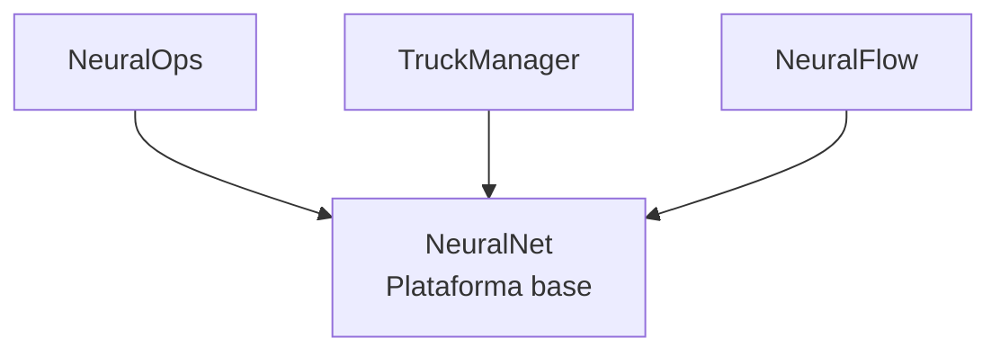

# Ecosistema NeuralNet

NeuralNet es la marca principal del ecosistema. Bajo esta marca viven distintos aplicativos y una base tecnológica compartida que permite reutilizar componentes de infraestructura, seguridad, almacenamiento, mensajería y persistencia en todos los proyectos.

## Aplicativos

| Aplicativo | Qué hace | Stack principal |
|---|---|---|
| [NeuralNet](neuralnet/index.md) | Marca y plataforma base con componentes reutilizables para el ecosistema | Docker, Keycloak, PostgreSQL, MinIO, Vault, Kafka, Redis |
| [NeuralOps](neuralops/index.md) | Automatización de procesos administrativos y operativos | Angular o React, .NET 8-10, FastAPI, Keycloak, MinIO, Kafka, Redis |
| [TruckManager](truckmanager/index.md) | Gestión y control de operaciones de transporte de carga | React, .NET, Kotlin, servicios compartidos de la plataforma |
| [NeuralFlow](neuralflow/index.md) | App móvil para gestión de tareas personales y recurrentes | Android, Kotlin, MVVM, Room, WorkManager, AlarmManager |

## Arquitectura general

## Enfoque del ecosistema

- NeuralNet funciona como marca paraguas y base común
- Infraestructura reutilizable para múltiples sistemas
- Servicios desacoplados y orientados a microservicios
- Integración centralizada de seguridad, almacenamiento y mensajería
- Base lista para desplegar y escalar por módulos
