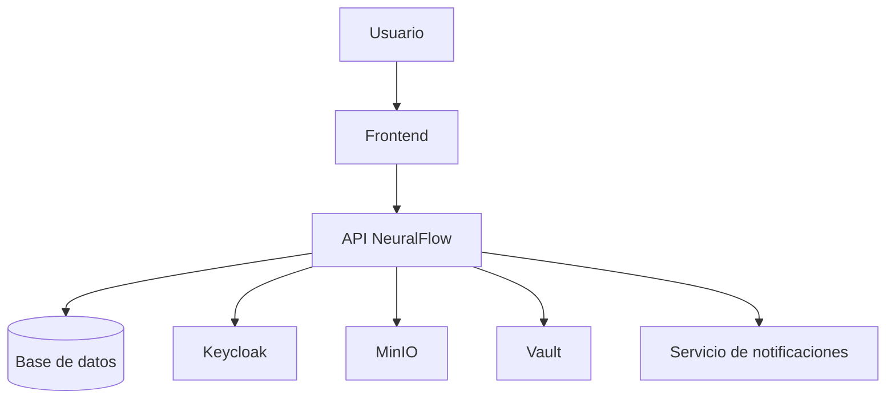

# NeuralFlow — Arquitectura

## Diagrama de componentes

## Stack tecnológico

| Capa | Tecnología |
|---|---|
| Frontend | — |
| Backend / API | — |
| Base de datos | — |
| Notificaciones | — |

!!! note
    Completar según las tecnologías definidas para el proyecto.
