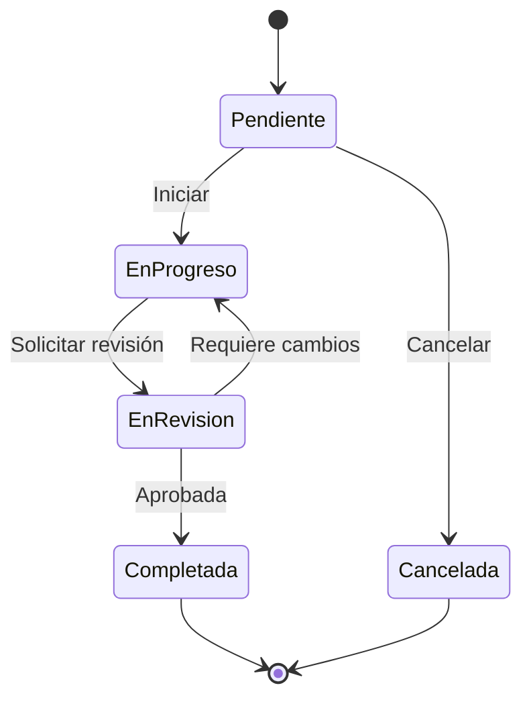

# NeuralFlow — Gestión de tareas

## Ciclo de vida de una tarea

## Campos de una tarea

| Campo | Descripción |
|---|---|
| `Título` | Descripción breve de la tarea |
| `Asignado a` | Usuario responsable |
| `Prioridad` | Baja / Media / Alta / Crítica |
| `Fecha límite` | Fecha de vencimiento |
| `Estado` | Pendiente / En progreso / En revisión / Completada |
| `Etiquetas` | Categorías libres |
