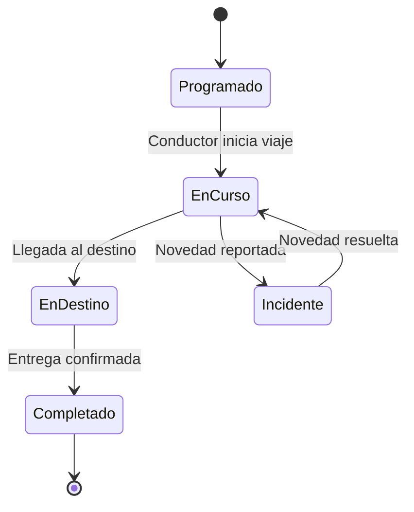

# TruckManager — Flujo de transporte

## Ciclo de vida de un viaje

## Estados del viaje

| Estado | Descripción |
|---|---|
| `Programado` | Viaje creado, pendiente de inicio |
| `En curso` | Conductor en ruta |
| `En destino` | Llegó al punto de entrega |
| `Completado` | Entrega exitosa confirmada |
| `Incidente` | Novedad activa durante el trayecto |
