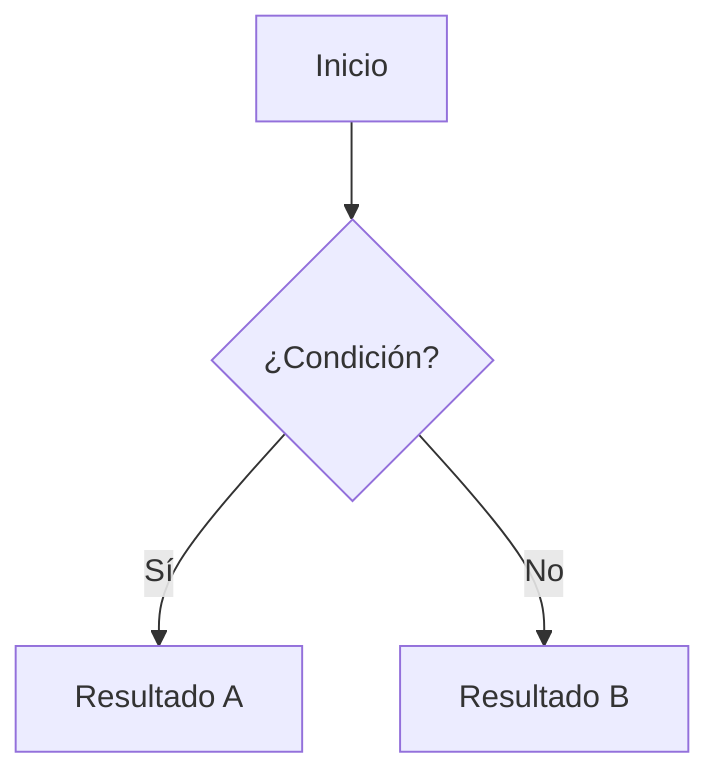

# MkDocs + Material Theme — Instalación, Configuración y Ejecución

## Requisitos previos

- Python 3.8 o superior
- `pip` actualizado

Verificar versiones:

```bash
python --version
pip --version
```

---

## 1. Instalación

### Instalar MkDocs y el tema Material

```bash
pip install mkdocs mkdocs-material
```

### Dependencias opcionales recomendadas

```bash
# Soporte para diagramas (Mermaid), resaltado de código avanzado, etc.
pip install mkdocs-material[imaging]   # Soporte para social cards (requiere Cairo)
pip install pymdown-extensions         # Extensiones Markdown avanzadas
```

Verificar la instalación:

```bash
mkdocs --version
```

---

## 2. Crear un proyecto nuevo

```bash
mkdocs new mi-proyecto
cd mi-proyecto
```

Estructura generada:

```
mi-proyecto/
├── docs/
│   └── index.md        # Página principal
└── mkdocs.yml          # Archivo de configuración
```

---

## 3. Configuración — `mkdocs.yml`

Reemplaza el contenido de `mkdocs.yml` con la siguiente configuración base:

```yaml
site_name: Mi Documentación
site_url: https://mi-sitio.com
site_description: Descripción del sitio
site_author: Tu Nombre

# Repositorio (opcional)
repo_name: usuario/repo
repo_url: https://github.com/usuario/repo

theme:
  name: material
  language: es

  # Paleta de colores (modo claro / oscuro)
  palette:
    - scheme: default
      primary: indigo
      accent: indigo
      toggle:
        icon: material/brightness-7
        name: Cambiar a modo oscuro
    - scheme: slate
      primary: indigo
      accent: indigo
      toggle:
        icon: material/brightness-4
        name: Cambiar a modo claro

  # Fuente
  font:
    text: Roboto
    code: Roboto Mono

  # Íconos y logo
  # logo: assets/logo.png
  # favicon: assets/favicon.png

  features:
    - navigation.tabs          # Pestañas superiores
    - navigation.tabs.sticky   # Pestañas fijas al hacer scroll
    - navigation.sections      # Secciones en la barra lateral
    - navigation.expand        # Expandir secciones automáticamente
    - navigation.top           # Botón "volver arriba"
    - navigation.footer        # Navegación anterior/siguiente en el pie
    - search.suggest           # Sugerencias en la búsqueda
    - search.highlight         # Resaltar resultados de búsqueda
    - content.code.copy        # Botón copiar en bloques de código
    - content.tabs.link        # Pestañas de contenido enlazables

# Extensiones Markdown
markdown_extensions:
  - admonition                 # Bloques de nota, advertencia, etc.
  - pymdownx.details           # Bloques colapsables
  - pymdownx.superfences:      # Código dentro de otros bloques
      custom_fences:
        - name: mermaid
          class: mermaid
          format: !!python/name:pymdownx.superfences.fence_code_format
  - pymdownx.highlight:        # Resaltado de sintaxis
      anchor_linenums: true
  - pymdownx.inlinehilite      # Resaltado en línea
  - pymdownx.snippets          # Incluir fragmentos de otros archivos
  - pymdownx.tabbed:           # Pestañas de contenido
      alternate_style: true
  - pymdownx.emoji:            # Soporte de emojis
      emoji_index: !!python/name:material.extensions.emoji.twemoji
      emoji_generator: !!python/name:material.extensions.emoji.to_svg
  - attr_list                  # Atributos en elementos Markdown
  - md_in_html                 # Markdown dentro de HTML
  - tables                     # Tablas
  - toc:                       # Tabla de contenidos
      permalink: true

# Plugins
plugins:
  - search:
      lang: es

# Navegación (opcional — si se omite, MkDocs la genera automáticamente)
nav:
  - Inicio: index.md
  - Guía:
      - Instalación: guia/instalacion.md
      - Configuración: guia/configuracion.md
  - Referencia: referencia.md
```

---

## 4. Estructura de carpetas recomendada

```
mi-proyecto/
├── docs/
│   ├── index.md
│   ├── assets/
│   │   ├── logo.png
│   │   └── favicon.png
│   ├── guia/
│   │   ├── instalacion.md
│   │   └── configuracion.md
│   └── referencia.md
├── mkdocs.yml
└── requirements.txt
```

### `requirements.txt` recomendado

```
mkdocs>=1.5
mkdocs-material>=9.0
pymdown-extensions>=10.0
```

---

## 5. Ejecutar el servidor de desarrollo

```bash
mkdocs serve
```

Abre el navegador en: **http://127.0.0.1:8000**

El servidor recarga automáticamente al guardar cambios.

| Opción útil | Descripción |
|---|---|
| `mkdocs serve --dev-addr 0.0.0.0:8080` | Cambia la dirección/puerto |
| `mkdocs serve --watch docs/` | Vigila una carpeta específica |

---

## 6. Compilar el sitio estático

```bash
mkdocs build
```

Genera la carpeta `site/` lista para desplegar en cualquier hosting estático.

Limpiar antes de reconstruir:

```bash
mkdocs build --clean
```

---

## 7. Despliegue en GitHub Pages

```bash
mkdocs gh-deploy
```

Esto compila el sitio y lo sube automáticamente a la rama `gh-pages` del repositorio.

---

## 8. Elementos útiles de Material Theme

### Admonitions (bloques destacados)

```markdown
!!! note "Nota"
    Contenido de la nota.

!!! warning "Advertencia"
    Contenido de la advertencia.

??? tip "Consejo colapsable"
    Este bloque está cerrado por defecto.
```

**Tipos disponibles:** `note`, `abstract`, `info`, `tip`, `success`, `question`, `warning`, `failure`, `danger`, `bug`, `example`, `quote`

### Pestañas de contenido

```markdown
=== "Python"
    ```python
    print("Hola mundo")
    ```

=== "JavaScript"
    ```javascript
    console.log("Hola mundo");
    ```
```

### Diagramas Mermaid

```markdown

```

---

## 9. Referencia rápida de comandos

| Comando | Descripción |
|---|---|
| `mkdocs new <nombre>` | Crear nuevo proyecto |
| `mkdocs serve` | Servidor de desarrollo con recarga automática |
| `mkdocs build` | Compilar sitio estático en `site/` |
| `mkdocs build --clean` | Compilar limpiando artefactos anteriores |
| `mkdocs gh-deploy` | Publicar en GitHub Pages |
| `mkdocs --help` | Ayuda general |

---

## Referencias

- [MkDocs — Documentación oficial](https://www.mkdocs.org)
- [Material for MkDocs — Documentación oficial](https://squidfunk.github.io/mkdocs-material)
- [Material — Referencia de componentes](https://squidfunk.github.io/mkdocs-material/reference/)
